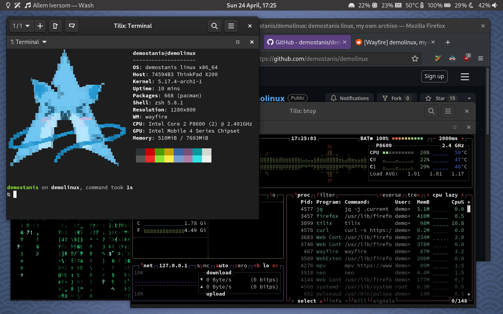

# demostanis linux

To build packages, build the ISO and test it inside QEMU:

  `# make`

For other make targets, check the Makefile.

Donate at 0xF239e7C7b1C75EFF467EE4b74CEB4002E3d00BEE to express your gratefulness towards my hours spent working on this.
